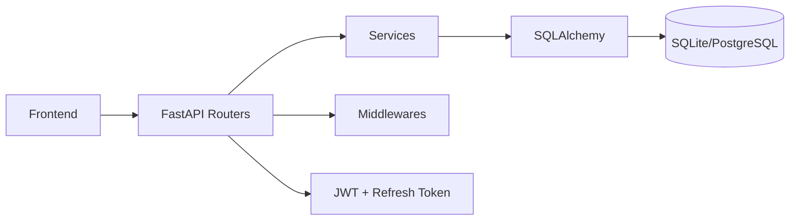

# LojaControl - Fullstack Portfolio Project

[](https://github.com/LypexzDev/Projeto-4-frontend-backend/actions/workflows/ci.yml)


[](./LICENSE)


Projeto fullstack de loja virtual com painel admin e area cliente.
O foco e demonstrar arquitetura backend profissional, seguranca, testes, dockerizacao e readiness para deploy.

## Quick Links

- [Arquitetura](#arquitetura)
- [Como Rodar Local](#como-rodar-local)
- [Docker](#docker)
- [Migrations Alembic](#migrations-alembic)
- [Testes](#testes)
- [Deploy](#deploy)
- [Documentacao Extra](#documentacao-extra)

## Highlights

- Arquitetura em camadas: `routes`, `services`, `models`, `schemas`, `core`
- SQLAlchemy com SQLite/PostgreSQL
- JWT com access token + refresh token rotativo
- Handlers globais de erro + logging estruturado
- Rate limiting
- Paginacao, filtros e busca
- Testes automatizados com cobertura
- CI com GitHub Actions
- Dockerfile + docker-compose

## Stack

- Backend: FastAPI
- ORM: SQLAlchemy 2.x
- Migrations: Alembic
- Auth: `python-jose` + `passlib[bcrypt]`
- Frontend: HTML, CSS, JavaScript modular
- Testes: `pytest`, `pytest-cov`, `httpx`, `TestClient`

## Arquitetura

```text
.
|-- app/
|   |-- api/
|   |   |-- deps.py
|   |   `-- routers/
|   |-- core/
|   |-- db/
|   |-- schemas/
|   `-- services/
|-- alembic/
|-- tests/
|-- docs/
|-- apiClient.js
|-- script.js
|-- Dockerfile
|-- docker-compose.yml
`-- testebackend.py
```



## Como Rodar Local

```powershell
python -m venv .venv
.\.venv\Scripts\Activate.ps1
pip install -r requirements.txt
python -m uvicorn testebackend:app --host 127.0.0.1 --port 8000 --reload
```

- App: `http://127.0.0.1:8000`
- Swagger: `http://127.0.0.1:8000/docs`

## Variaveis de Ambiente

Arquivos base:

- `.env.example`
- `.env.development.example`
- `.env.production.example`

Principais variaveis:

- `LOJACONTROL_ENV`
- `LOJACONTROL_DATABASE_URL`
- `LOJACONTROL_JWT_SECRET`
- `LOJACONTROL_ACCESS_TOKEN_EXPIRE_MINUTES`
- `LOJACONTROL_REFRESH_TOKEN_EXPIRE_DAYS`
- `LOJACONTROL_REFRESH_COOKIE_NAME`
- `LOJACONTROL_CORS_ORIGINS`
- `LOJACONTROL_RATE_LIMIT_*`
- `LOJACONTROL_AUTO_CREATE_SCHEMA`

Em produção, a aplicação bloqueia bootstrap com configuração insegura (secret fraco, CORS com `*`, senha admin padrão ou schema auto-create habilitado).

## Migrations Alembic

```powershell
alembic revision --autogenerate -m "descricao"
alembic upgrade head
alembic downgrade -1
```

## Docker

Subir app + postgres:

```powershell
docker compose up --build
```

Parar:

```powershell
docker compose down
```

Limpar volumes:

```powershell
docker compose down -v
```

## Testes

```powershell
pytest
pytest --cov=app --cov-report=term-missing
```

## Endpoints de Destaque

- `POST /auth/register-user`
- `POST /auth/login-user`
- `POST /auth/login-admin`
- `POST /auth/refresh`
- `GET /health`
- `GET /shop/produtos/paginated`
- `GET /admin/usuarios/paginated`
- `GET /admin/pedidos/paginated`

## cURL rapido

```bash
curl -X POST http://127.0.0.1:8000/auth/login-admin \
  -H "Content-Type: application/json" \
  -d '{"email":"admin@lojacontrol.local","password":"admin123"}'
```

```bash
curl -c cookies.txt -X POST http://127.0.0.1:8000/auth/login-admin \
  -H "Content-Type: application/json" \
  -d '{"email":"admin@lojacontrol.local","password":"admin123"}'
```

```bash
curl -b cookies.txt -X POST http://127.0.0.1:8000/auth/refresh
```

## Deploy

### Render

1. Criar Web Service apontando para este repo.
2. Build command: `pip install -r requirements.txt`
3. Start command: `uvicorn testebackend:app --host 0.0.0.0 --port $PORT`
4. Configurar env vars.

### Railway

1. Importar repo.
2. Adicionar PostgreSQL.
3. Configurar `LOJACONTROL_DATABASE_URL` e segredos JWT.

### VPS

1. Subir app com `uvicorn`/`gunicorn`.
2. Configurar Nginx como reverse proxy.
3. Configurar TLS (Certbot) e systemd.

## Screenshots

Coloque imagens em `docs/images/`:

- `docs/images/login.png`
- `docs/images/admin-dashboard.png`
- `docs/images/shop.png`

## Documentacao Extra

- [Arquitetura detalhada](./docs/ARCHITECTURE.md)
- [Roadmap](./docs/ROADMAP.md)
- [Contribuicao](./CONTRIBUTING.md)
- [Seguranca](./SECURITY.md)
- [Changelog](./CHANGELOG.md)

## Como Apresentar em Entrevista

Pitch curto:

1. "Comecei com backend simples e JSON."
2. "Evolui para arquitetura em camadas com SQLAlchemy e Alembic."
3. "Implementei JWT com refresh token, rate limiting, logging e testes."
4. "Fechei com Docker, CI e docs de deploy."

## Licenca

MIT - veja [LICENSE](./LICENSE).
